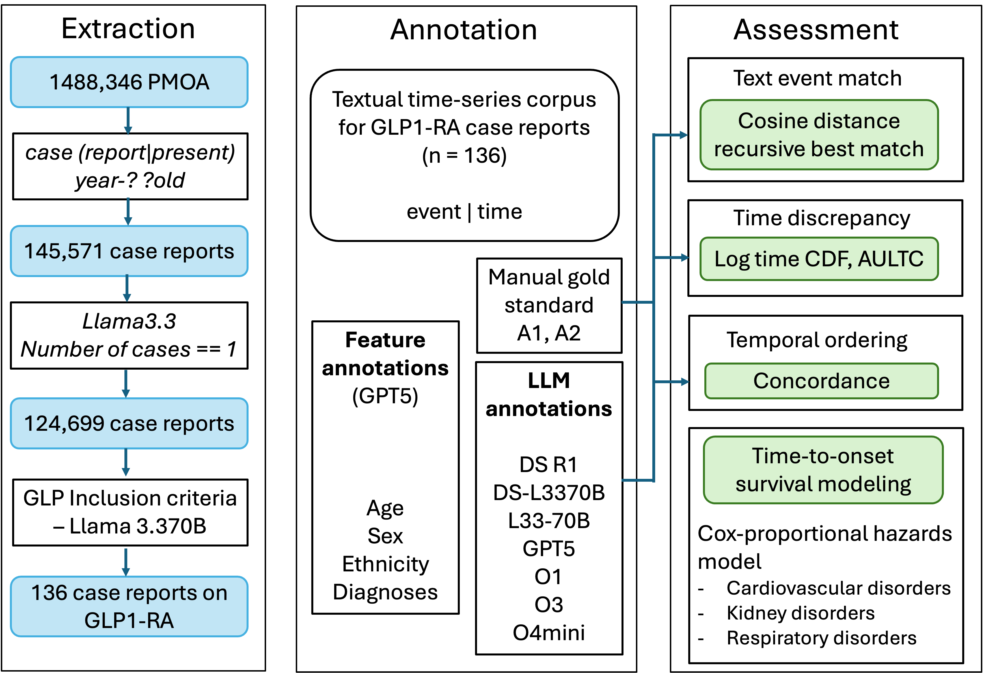
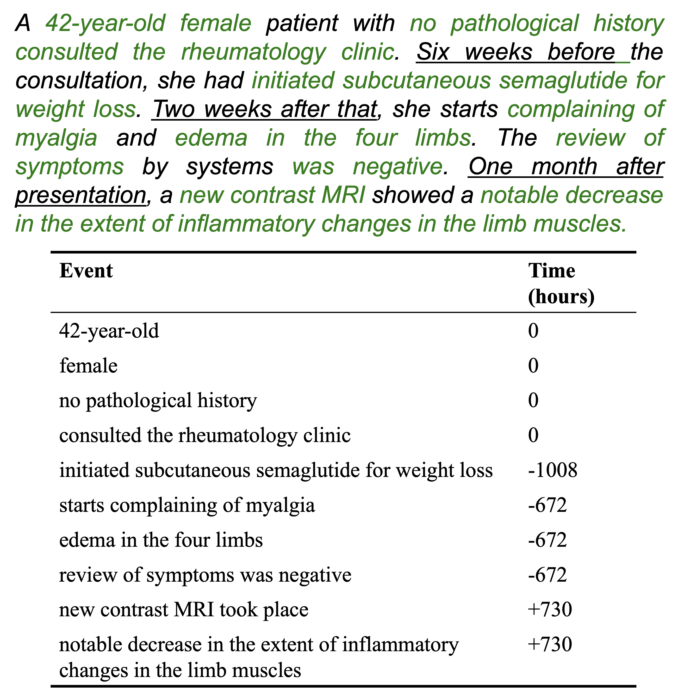

# Temporally Phenotyping GLP-1RA Case Reports with Large Language Models

<div align="center">

[](https://python.org)
[](https://jupyter.org)
[](https://allenai.github.io/scispacy/)
[](https://lifelines.readthedocs.io/)

</div>

## Overview

This repository contains analysis notebooks for the study **"Temporally Phenotyping GLP-1RA Case Reports with Large Language Models: A Textual Time Series Corpus and Risk Modeling"**. This paper has been accepted as a full paper in the AMIA Annual Symposium, to be held at Dallas on November 2026.

The study converts PubMed Open Access single-patient case reports involving glucagon-like peptide-1 receptor agonists (GLP-1RAs) into clinical textual time series: event-time pairs where each clinical event is assigned a timestamp in hours relative to a case-specific reference point. The paper uses these timelines to evaluate LLM-based temporal extraction against expert annotations, characterize diagnosis patterns in the GLP-1RA PMOA cohort, and demonstrate downstream time-to-onset modeling for kidney, cardiovascular, and respiratory outcomes.

The notebooks in this release are primarily for cohort characterization, UMLS diagnosis normalization, threshold-sweep evaluation, and survival analysis after timeline extraction has already been run. Raw PMOA texts, expert annotations, model outputs, and large intermediate artifacts are not included here unless released separately.

## Figures

### Study Workflow

[](paper_plots/fig1_worflow_with_example.pdf)

### Example Textual Time Series

[](paper_plots/fig1_worflow_with_example.pdf)

## Key Contributions

- **GLP-1RA Textual Time-Series Corpus**: Builds a medication-centered corpus from PubMed Open Access case reports by representing patient narratives as timestamped clinical events.
- **LLM Timeline Evaluation**: Compares LLM-extracted timelines against two clinically trained expert annotators using event match rate, temporal order concordance, and AULTC.
- **Diagnosis Characterization**: Uses scispaCy UMLS linking to normalize diagnosis strings and summarize cardiometabolic, kidney, respiratory, digestive, mental health, cancer, anemia, oral/dental, bone/joint, and sepsis categories.
- **Threshold Sensitivity Analysis**: Sweeps event-matching thresholds to study the tradeoff between semantic event coverage and temporal fidelity.
- **Time-to-Onset Modeling**: Constructs GLP-1RA treatment and comparison cohorts from textual timelines and fits Kaplan-Meier and Cox proportional hazards models for selected outcomes.

## Repository Structure

```text
code_github/
|-- create_medspacy_diagnosis_cui_data.ipynb      # Extract dx2 annotations and link diagnoses to UMLS CUIs
|-- diagnosis_GLP_PMOA.ipynb                      # GLP/diabetes cohort selection and diagnosis analyses
|-- diagnosis_char_med_spacy.ipynb                # Exploratory full-PMOA UMLS diagnosis summaries
|-- diagnosis-characterization-prevalence.ipynb   # Disease-category prevalence plots vs US baselines
|-- threshold_sweep.ipynb                         # Event match, concordance, and AULTC threshold sweeps
|-- survival_analyses_glp.ipynb                   # Treatment/control construction and survival modeling
|-- paper_plots/                                  # Figures used in the paper and README
`-- README.md                                     # This file
```

## Workflow

The analysis proceeds in six stages:

1. **Diagnosis annotation ingestion**: `create_medspacy_diagnosis_cui_data.ipynb` reads diagnosis `.bsv` files from a sharded PMOA annotation directory and writes `full_linked_diagnosis_data.pkl`.
2. **GLP-1RA and diabetes cohort setup**: `diagnosis_GLP_PMOA.ipynb` loads PMOA diagnosis annotations, restricts to GLP-1RA case reports, identifies diabetes-related reports, samples comparison cases, and creates linked diagnosis pickles.
3. **Diagnosis normalization and prevalence**: `diagnosis_char_med_spacy.ipynb` and `diagnosis-characterization-prevalence.ipynb` aggregate UMLS canonical diagnoses and disease-category prevalence.
4. **Timeline quality evaluation**: `threshold_sweep.ipynb` consumes precomputed `best_matches*.csv` files and computes event match rate, concordance, and AULTC across cosine-distance thresholds.
5. **Outcome extraction from textual time series**: `survival_analyses_glp.ipynb` searches LLM-extracted event-time CSVs for cardiovascular, respiratory, and kidney outcome keywords with lightweight negation handling.
6. **Survival modeling**: `survival_analyses_glp.ipynb` fills censoring times from each timeline's last observed timestamp and fits Kaplan-Meier and age/sex-adjusted Cox models.

## Quick Start

### 1. Clone And Install

```bash
git clone <repo-url>
cd code_github

conda create -n glp-tts python=3.10
conda activate glp-tts

pip install jupyter pandas numpy matplotlib seaborn tqdm scikit-learn scipy statsmodels lifelines spacy scispacy
```

The UMLS normalization notebooks use the large scispaCy model:

```bash
pip install https://s3-us-west-2.amazonaws.com/ai2-s2-scispacy/releases/v0.5.4/en_core_sci_lg-0.5.4.tar.gz
```

The notebooks call:

```python
nlp = spacy.load("en_core_sci_lg")
nlp.add_pipe("scispacy_linker", config={"resolve_abbreviations": True, "linker_name": "umls"})
```

The first UMLS linker run may download additional knowledge-base files.

### 2. Prepare Local Artifacts

The notebooks expect local research artifacts that are not committed to this repository:

- PMOA diagnosis annotation folders with paths like `PMC000xxxxxx/anns/dx2/PMC*_body.txt.bsv.gz`
- GLP-1RA case report text files named like `PMC*_body.txt`
- LLM-extracted textual time series CSV files with at least `event` and `time` columns
- Expert/reference timeline files and `best_matches*.csv` comparison outputs
- Demographic CSVs used for age/sex adjustment
- Intermediate diagnosis pickle files such as `full_linked_diagnosis_data.pkl`, `glp_linked_diagnosis_data.pkl`, `diagnosis_case_diabetes_glp.pkl`, and `diagnosis_control_diabetes_nonglp.pkl`

### 3. Update Paths

The notebooks currently contain absolute paths from the study environment, for example:

```text
/Users/kumars33/Desktop/Diabetes_LLM_annotation/
/Users/kumars33/Desktop/CHARM_MIMIC/
/Users/kumars33/Desktop/TTA/Textual_tabular_alignment-main/
```

Before running, edit the path cells near the top of each notebook to point to your local copies of the PMOA annotations, case reports, timeline CSVs, and match files.

### 4. Run Notebooks

Open Jupyter and run only the notebooks needed for your analysis:

```bash
jupyter lab
```

Suggested order:

1. `create_medspacy_diagnosis_cui_data.ipynb`
2. `diagnosis_GLP_PMOA.ipynb`
3. `diagnosis-characterization-prevalence.ipynb`
4. `threshold_sweep.ipynb`
5. `survival_analyses_glp.ipynb`

`diagnosis_char_med_spacy.ipynb` is an exploratory companion for full-PMOA diagnosis summaries.

## Main Outputs

| Output | Produced By | Description |
| --- | --- | --- |
| `full_linked_diagnosis_data.pkl` | `create_medspacy_diagnosis_cui_data.ipynb` | UMLS-linked diagnosis dictionary for the broader PMOA case-report pool. |
| `glp_linked_diagnosis_data.pkl` | `diagnosis_GLP_PMOA.ipynb` | UMLS-linked diagnosis dictionary for GLP-1RA case reports. |
| `diagnosis_case_diabetes_glp.pkl` | `diagnosis_GLP_PMOA.ipynb` | Linked diagnoses for diabetes reports with GLP-1RA exposure. |
| `diagnosis_control_diabetes_nonglp.pkl` | `diagnosis_GLP_PMOA.ipynb` | Linked diagnoses for sampled diabetes comparison reports. |
| `paper_plots/top20_diagnoses_glp.pdf` | `diagnosis_GLP_PMOA.ipynb` | Top UMLS-normalized diagnoses in the GLP-1RA cohort. |
| `paper_plots/disease_prevalence.pdf` | `diagnosis-characterization-prevalence.ipynb` | Broad disease-category prevalence vs US adult baselines. |
| `paper_plots/concordance_vs_EMR_*.pdf` | `threshold_sweep.ipynb` | Concordance vs event match rate across matching thresholds. |
| `paper_plots/aultc_vs_EMR_*.pdf` | `threshold_sweep.ipynb` | AULTC vs event match rate across matching thresholds. |
| `paper_plots/survival_all_plots.pdf` | `survival_analyses_glp.ipynb` | Survival-analysis summary plots. |
| `paper_plots/*_cox_survival.pdf` | `survival_analyses_glp.ipynb` | Outcome-specific adjusted survival plots. |

## Data

This repository does not include the full PubMed Open Access source corpus, intermediate PMOA annotation trees, expert annotations, or all LLM-extracted timelines. The paper reports that temporal annotations and code will be released upon acceptance. Until those artifacts are available, the notebooks should be treated as reproducibility and analysis code for users who have the corresponding local data.

Expected timeline CSV format:

```csv
event,time
55-year-old man,0
started semaglutide,-720
admitted to hospital,0
acute kidney injury,72
discharged home,168
```

Times are stored in hours relative to the case reference point. Negative values indicate events before the reference time.

## Models

The paper evaluates multiple LLMs for textual time-series extraction, including DeepSeek R1, DeepSeek-R1-Distill-Llama-70B, Llama-3.3-70B-Instruct, GPT5, O1, O3, and O4mini. The notebooks in this archive do not serve or call those LLMs directly; instead, they analyze generated timeline outputs and match files.

For diagnosis normalization, the notebooks use:

- `en_core_sci_lg`
- `scispacy_linker`
- UMLS candidate filtering by score threshold, with top-ranked CUI/canonical-name summaries

For survival modeling, the notebooks use:

- `lifelines.KaplanMeierFitter`
- `lifelines.CoxPHFitter`
- age and sex covariate adjustment
- bootstrap uncertainty bands for adjusted survival curves

## Notes And Caveats

- Several notebooks are exploratory and contain repeated or commented analysis cells from different experiments.
- Many paths are absolute and must be changed before reuse.
- Some cells assume intermediate pickle files or `best_matches*.csv` files have already been created.
- The `compare_tts/` folder in this archive is empty aside from system metadata; threshold-sweep logic is currently in `threshold_sweep.ipynb`.
- Outcome detection in the survival notebook is keyword-based and should be interpreted as time to first documented mention in the textual time series, not necessarily biological onset.
- Case reports are a biased clinical-informatics cohort, not a representative epidemiologic sample; hazard ratios in the paper are associative rather than causal.

## Citation

If you use this code or build on this work, please cite:

```bibtex
@inproceedings{kumar2026glp_tts,
  title = {Temporally Phenotyping GLP-1RA Case Reports with Large Language Models: A Textual Time Series Corpus and Risk Modeling},
  author = {Kumar, Sayantan and Weiss, Jeremy C.},
  booktitle = {AMIA Symposium},
  year = {2026},
  note = {Forthcoming}
}
```


